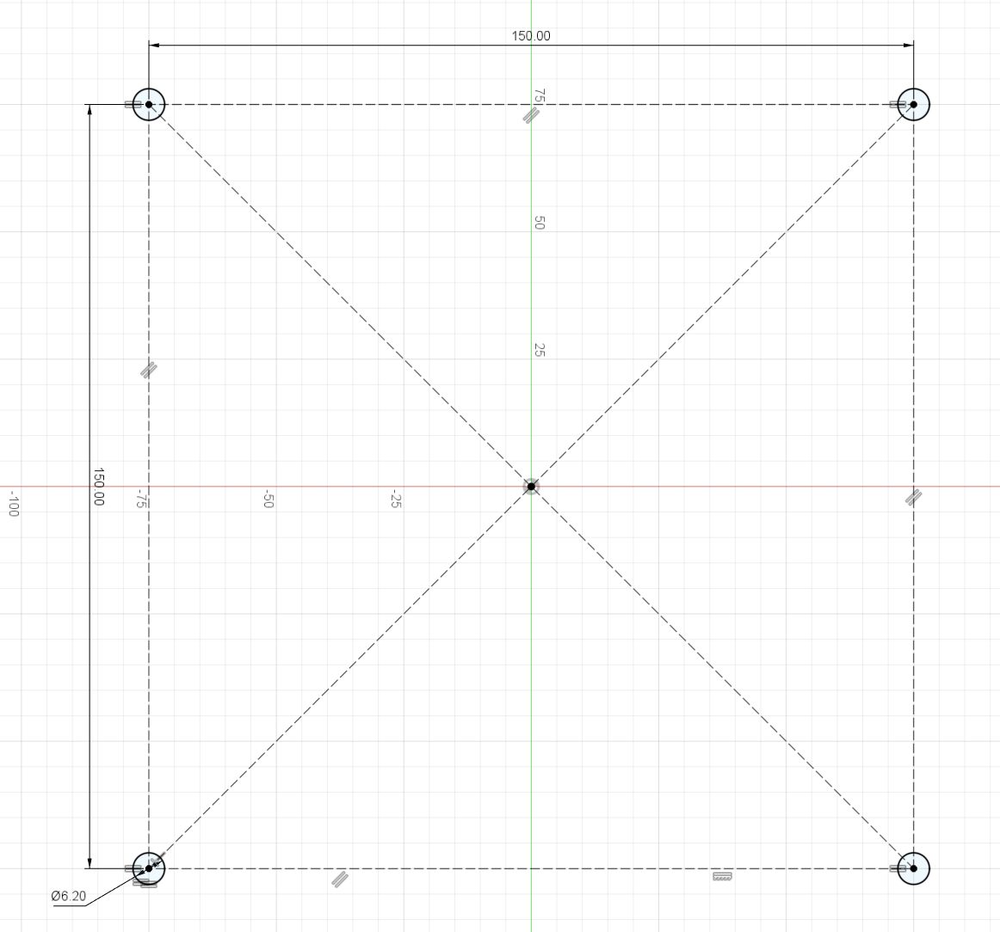
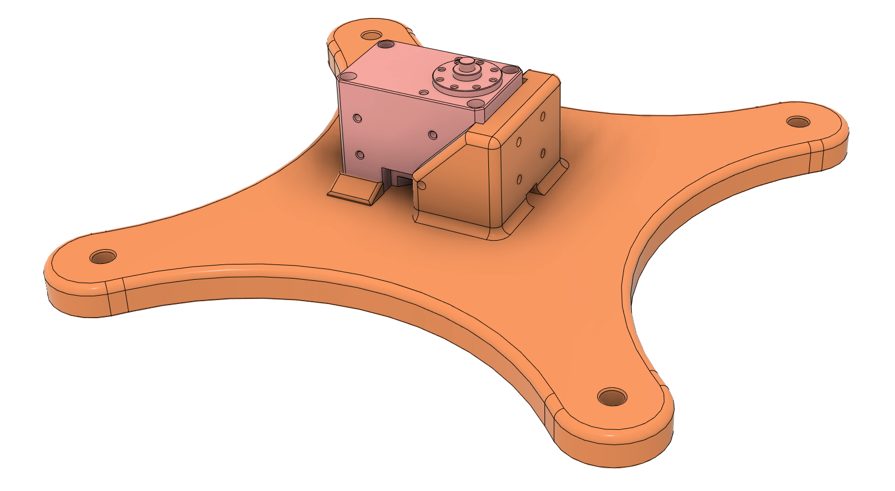
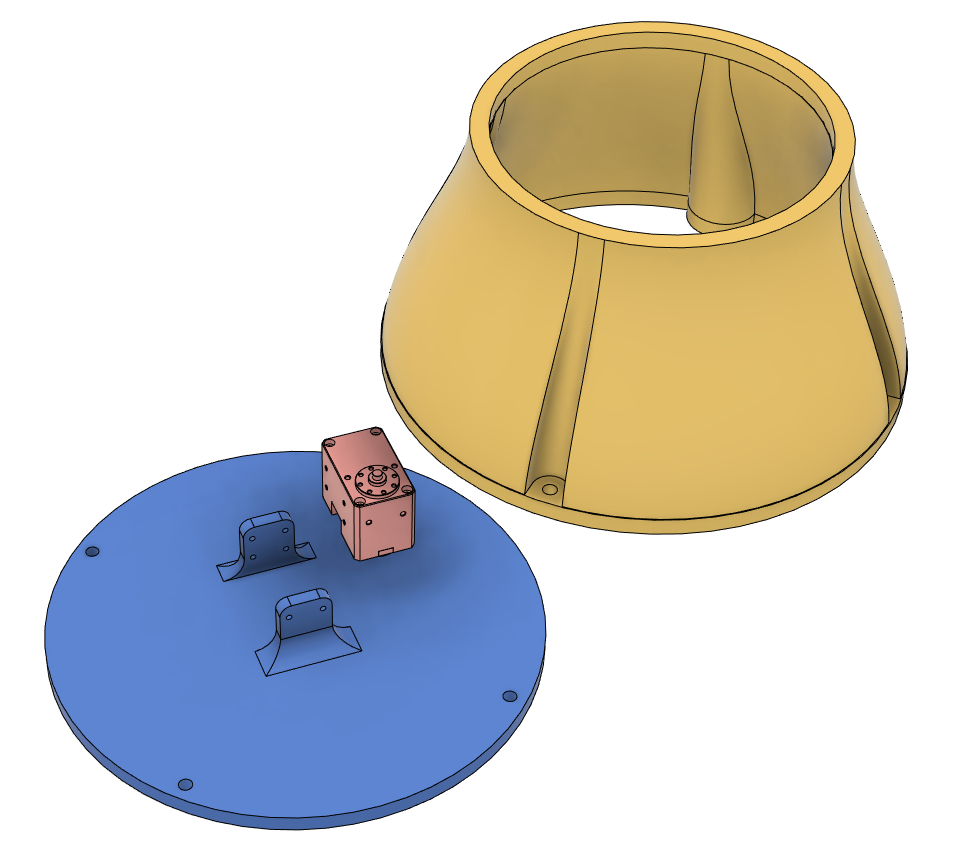

# Hand-in 1: Design First Part of Robot
{: .d-inline-block }
Individual
{: .label .label-blue } 
In this hand-in you are going to **design and 3D print the first part of your robot** -- the robot's base. The base connects the base plate to the first joint.

## Design Constraints
Design the base such that it fits the M6 mounting holes in the 150mm square pattern on [base plate](https://frdedynamics.github.io/ADA526/docs/project.html#base-plate).

<a href="../../assets/images/mounting_square_sketch.png" width="330">
    
</a>

The base must also feature an attachment for the first Dynamixel motor (XM430-W350-T) with the rotational axis pointing upwards in the center of the mounting square.
Checkout [this section](https://emanual.robotis.com/docs/en/dxl/x/xm430-w350/#custom-frame-assembly) in the Dynamixel manual to see how you can fasten the motor.
The side tabs on the motor have M2.5 threads. The side tabs have a max depth of 3mm, screwing in anything deeper can destroy the motors! Thus, make sure your design is geared to the screws we have available. We have M2.5 screws ([DIN912](https://www.mcmaster.com/products/socket-head-cap-screws/specifications-met~din-912/18-8-stainless-steel-socket-head-screws-11/thread-size~m2-5/threading~fully-threaded/)) of length 8mm, 10mm and 20mm.  
Think also about the tolerances of the 3D printer when designing the attachment for the motor. It is often a good idea to make attachments that do not over-constrain the motor too much, and/or to add some tolerance to the attachment instead of working with the motor's exact dimensions. You are aiming for a snug fit, not a press fit -- screws will hold the motor in place.  
Keep in mind that printing large flat surfaces can be challenging and often leads to warping.

The technical drawings of the motors as well as CAD-models, can be found in the [Drawings](https://emanual.robotis.com/docs/en/dxl/x/xm430-w350/#drawings) section. For importing the CAD files, download the ```.stp```- file and upload it into your Fusion project.

Remember that your base can consist of multiple parts. 

<p float="center">
  
   
</p>
 _Examples of base designs. Feel free to completely deviate from them._


## Deliverables
You have to submit:
- .f3z file of your Fusion project (in Fusion: ```File > Export > *.f3z```)
- .3mf file of your Bambu Studio slicer project (in Bambu Studio: ```File > Save Project As...```)
- one din4 page where you reflect your design process (**max. 300 words**). For example, describe the idea behind your design and how you did get from constraints to finished design, considerations you made, things you learned underway. Include a screenshot of your design in Fusion, and a photo of the 3D printed base with the motor sitting in its attachment. Submit the page in .pdf format.

You have to print your base to take a photo, but you don't have to submit the physical part. If you have questions or issues with printing, please contact us on Discord.


**Deadline: Midnight, Thursday 14.9.23.**  
**Submit files on Canvas. This is an individual hand-in.**

