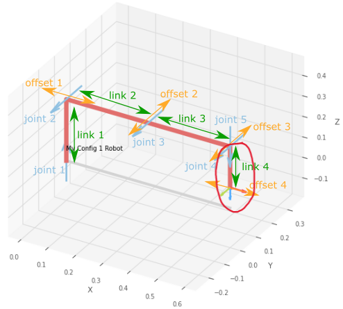
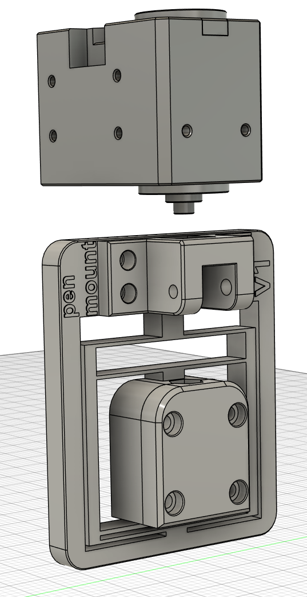
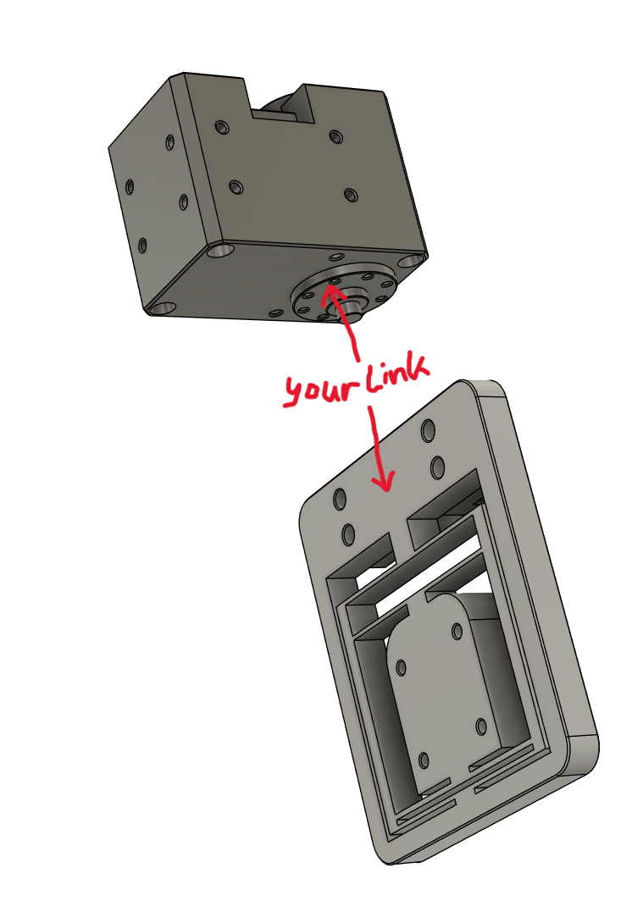

# Hand-in 1: Design Last Link of Robot
{: .d-inline-block }
Individual
{: .label .label-blue } 
In this hand-in you are going to **design and 3D print the first robot part** -- the last link of the robot arm. We start with the outermost link because this is common design practice. Once the outer links and end-effector are known, the lower links can be designed based on the loads caused by everything further out in the kinematic chain.

## Design Constraints
You are designing link 4 of the robot arm, the last link before the end effector. In the kinematic model, this is the short link connected to joint 5. In the physical robot, the last joint axis points downwards when the robot is in its home configuration. During movement, this axis can of course point in other directions. This means that one side of your link must mount to the Dynamixel servo horn, with the horn facing down in the home configuration.

<p float="center">
  
  
</p>

On the other side of the link, you must provide the mounting holes for the pen mount that will be used in the [competition](../project#competition). The marked figure below shows the part you are designing. Apart from the mounting flanges/interfaces on both sides, you are free to design the link between them.



## Dynamixel Horn Mounting
For this hand-in, your link mounts to the servo horn, not to the side tabs of the motor. Use the motor and horn geometry from the Dynamixel drawings/CAD models to place the mounting holes correctly. The horn side of your link should be designed such that the last joint axis points down in the home configuration, as shown in the figures above.

Think also about the tolerances of the 3D printer when designing the horn attachment. You are aiming for a snug fit, not a press fit -- screws will hold the link in place.

The technical drawings of the motors as well as CAD-models can be found in the Drawings section of the Dynamixel manuals. For importing the CAD files, download the `.stp` file and upload it into your Fusion project.

[XM430-W350-T Drawings](https://emanual.robotis.com/docs/en/dxl/x/xm430-w350/#drawings){: .btn .btn-blue}
[XM540-W150-T Drawings](https://emanual.robotis.com/docs/en/dxl/x/xm540-w150/#drawings){: .btn .btn-blue}

## Pen Mount Interface
The pen mount is the end-effector used in the competition. Your link must provide the mounting holes for this pen mount on the opposite side from the servo horn. Use the drawing below to place the holes correctly.

[Download Pen Mount](../../assets/cad/pen_mount.f3d){: .btn .btn-blue}

<object data="../../assets/images/Pen Mount Drawing new dim v2.pdf" type="application/pdf" width="800px" height="550px">
    <embed src="../../assets/images/Pen Mount Drawing new dim v2.pdf">
        <p>This browser does not support PDFs. Please download the PDF to view it: <a href="../../assets/images/Pen Mount Drawing new dim v2.pdf">Download PDF</a>.</p>
    </embed>
</object>

## Deliverables
You have to submit:
- .f3z file of your Fusion project (in Fusion: ```File > Export > *.f3d```)
- .3mf file of your Bambu Studio slicer project (in Bambu Studio: ```File > Save Project As...```)
- one din4 page where you reflect your design process (**max. 300 words**). For example, describe the idea behind your design and how you did get from constraints to finished design, considerations you made, things you learned underway. Include a screenshot of your design in Fusion, and a photo of the 3D printed link. Submit the page in .pdf format.

You have to print your link to take a photo, but you don't have to submit the physical part. If you have questions or issues with printing, please contact us on Discord.


**Deadline: Check Canvas**  
**Submit files on Canvas. This is an individual hand-in.**

