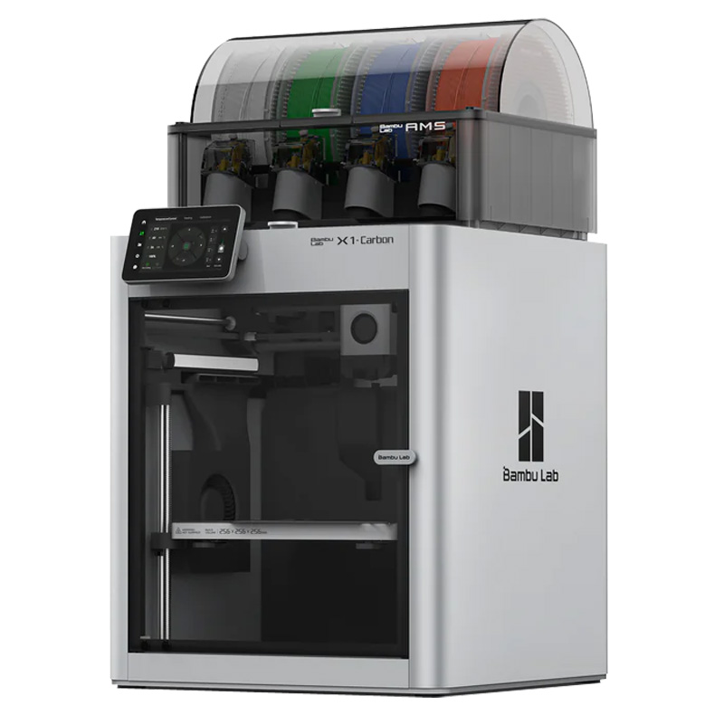
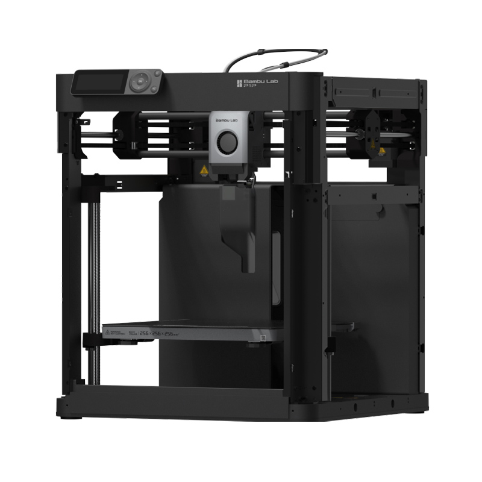

# 3D Printing
3D printing is the main fabrication technique we make use of in the semester project. On campus Bergen and Førde we have each have one Bambu Lab X1 Carbon with automatic material system and multiple Bambu Lab P1P printers. Both models are state of the art printers - fast yet precise. The motion system in both models is the same, but the X1 Carbon is fully enclosed which helps keeping the temperature stable, and it has additional sensors to monitor/adjust print quality. The material system on the X1 Carbon enables automatic material switching, which is very convenient when printing with multiple materials. On most usual PLA prints, X1 Carbon and P1P perform equally well.

**Official Bambu Lab manuals:**

| X1 Carbon                                                                                                 |  P1P
:----------------------------------------------------------------------------------------------------------:|:---------------------------------------------------------------------------------------------:
  | 
 [Introduction](https://wiki.bambulab.com/en/x1/manual#introduction){: .btn }                               | [Introduction](https://wiki.bambulab.com/en/p1/manual#introduction){: .btn }
 [Printing](https://wiki.bambulab.com/en/x1/manual#printing){: .btn }                                       | [Printing](https://wiki.bambulab.com/en/p1/manual#printing){: .btn }

## Tips and Tricks
### Variable Infill in Bambu Studio
You can easily split your model into parts and adjust settings locally in Bambu Studio. This is useful for minimizing the weight and material use of parts that require strength only in certain areas. 
<iframe width="560" height="315" src="https://www.youtube.com/embed/x4FI--m1bmI?si=JeXkbIUQr1Vl5OQp" title="YouTube video player" frameborder="0" allow="accelerometer; autoplay; clipboard-write; encrypted-media; gyroscope; picture-in-picture; web-share" allowfullscreen></iframe>

## Frikk's 3D Printing Guide
Frikk Fossdal has his own website for ADA525 where he has information on 3D printing connected to his lectures during the first weeks.

[Frikk's 3D Printing Guide](https://ada525.frikkfossdal.com/content/guides/3dprint){: .btn }
{: .text-center }

## Filament
We have mostly PLA in stock. If you want to use other materials, please contact staff.

## Where to find the printers
Bergen: Room D415/D425  
Førde: Robotics lab/experiment room next to the lab