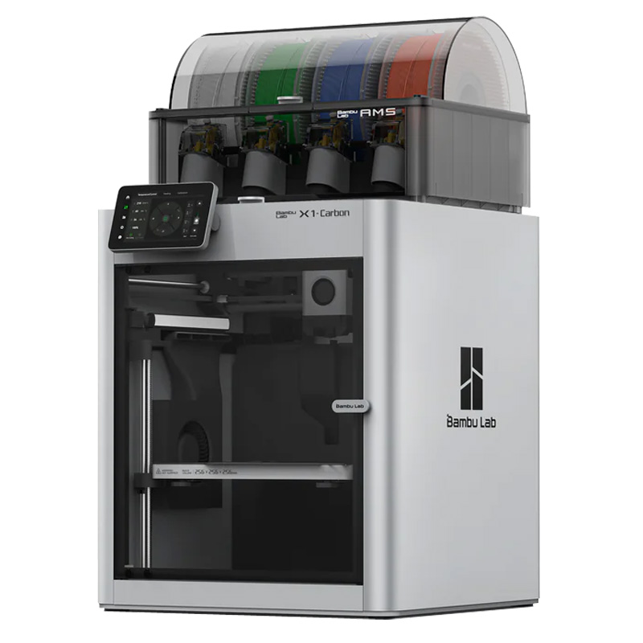
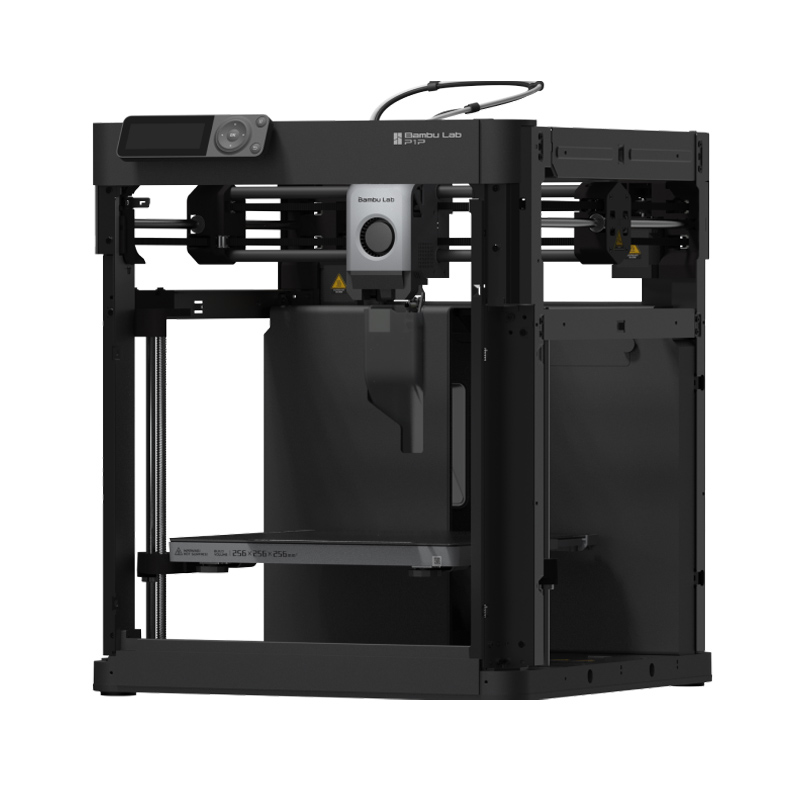

# 3D Printing
3D printing is the main fabrication technique we make use of in the semester project. On campus Bergen and Førde we have each have one Bambu Lab X1 Carbon with automatic material system and multiple Bambu Lab P1P printers. Both models are state of the art printers - fast yet precise. The motion system in both models is the same, but the X1 Carbon is fully enclosed which helps keeping the temperature stable, and it has additional sensors to monitor/adjust print quality. The material system on the X1 Carbon enables automatic material switching, which is very convenient when printing with multiple materials. On most usual PLA prints, X1 Carbon and P1P perform equally well.

**Official Bambu Lab manuals:**

| X1 Carbon                                                                                                 |  P1P
:----------------------------------------------------------------------------------------------------------:|:---------------------------------------------------------------------------------------------:
  | 
 [Introduction](https://wiki.bambulab.com/en/x1/manual#introduction){: .btn }                               | [Introduction](https://wiki.bambulab.com/en/p1/manual#introduction){: .btn }
 [Printing](https://wiki.bambulab.com/en/x1/manual#printing){: .btn }                                       | [Printing](https://wiki.bambulab.com/en/p1/manual#printing){: .btn }

## Design for 3D Printing
When designing parts, one should always consider the strengths and limitations of the manufacturing method that is going to be used to make the part. This also applies to 3D printing, even though it is often easy to overlook. Modern printers and slicers are very capable and can print almost any shape in almost any orientation, but the result is still strongly affected by how the part is designed. Print orientation, overhangs, tolerances, wall thickness, infill, and how the part is loaded should therefore be considered already in CAD.

The blog post linked below gives a very good and thorough overview of design for 3D printing. It focuses on functional FDM/FFF parts and collects many practical rules of thumb with examples. This is useful when designing robot links, joints, brackets and fixtures, where the parts should be strong, easy to print, and not use more material than needed.

[Design for 3D-Printing](https://blog.rahix.de/design-for-3d-printing/){: .btn .btn-blue}
{: .text-center }

You can also have a look at this teaching and learning package which provides an introduction to additive manufacturing methods, their advantages and limitations, and how the properties of printed objects are affected by varying printing parameters.

[Learning package on additive manufacturing](https://www.doitpoms.ac.uk/tlplib/add_manuf/index.php){: .btn .btn-blue}
{: .text-center }

## Variable Infill in Bambu Studio
You can easily split your model into parts and adjust settings locally in Bambu Studio. This is useful for minimizing the weight and material use of parts that require strength only in certain areas. 
<iframe width="560" height="315" src="https://www.youtube.com/embed/x4FI--m1bmI?si=JeXkbIUQr1Vl5OQp" title="YouTube video player" frameborder="0" allow="accelerometer; autoplay; clipboard-write; encrypted-media; gyroscope; picture-in-picture; web-share" allowfullscreen></iframe>
<!---
## Frikk's 3D Printing Guide
Frikk Fossdal has his own website for ADA525 where he has information on 3D printing connected to his lectures during the first weeks.

[Frikk's 3D Printing Guide](https://ada525.frikkfossdal.com/content/guides/3dprint){: .btn }
{: .text-center }
-->
## Filament
We have mostly PLA in stock. If you want to use other materials, please contact staff.

For an overview and comparison over different filaments for FDM printing have a look at the excellent guides from Prusa and Bambulab.

[Prusa Filament Guide](https://help.prusa3d.com/filament-material-guide){: .btn .btn-blue}
{: .text-center }

[Bambu Lab Filament Guide](https://bambulab.com/en-eu/filament/guide){: .btn .btn-blue}
{: .text-center }

## Where to find the printers
Bergen: Space 162 in K2

Førde: Robotics lab/experiment room next to the lab
