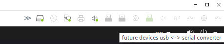
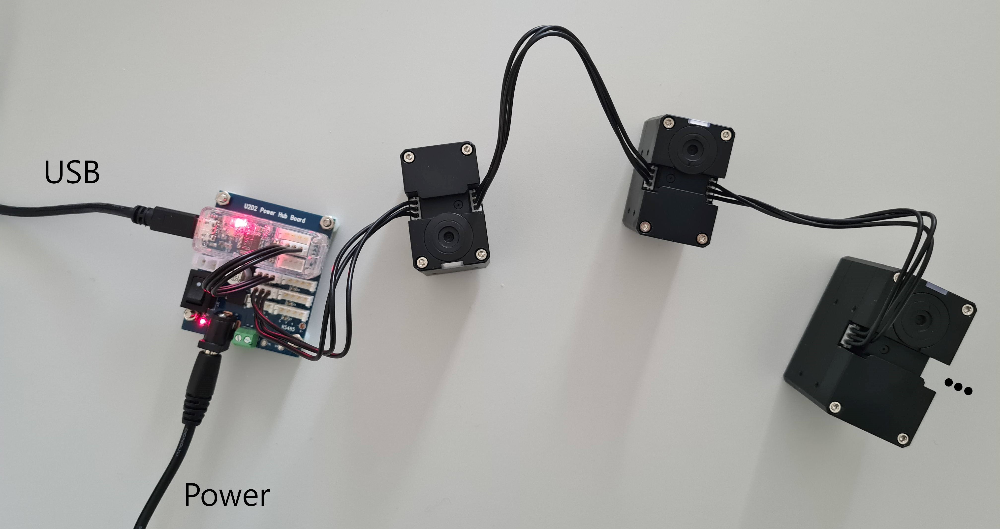

# Dynamixel Motors
{: .no_toc}

## Table of contents
{: .no_toc .text-delta }
- TOC
{:toc}

---

## Control Table
The control table is the internal data structure of the Dynamixel motors in which their configuration, sensor data and control parameters are stored. The table is divided into two areas: the RAM area and the EEPROM area. Data in the RAM area is reset to default values when power is disconnected (volatile), while data in the EEPROM area is stored permanently (non-volatile). The Dynamixel Wizard offers us a convenient GUI for reading and writing Data from/to the table - ideal for setting things up and doing initial tests. Later in the project, we will use the Dynamixel SDK to write data to specific addresses in the table from Python code, e.g. write to address `116` to set the goal position of the motor.
The detailed documentation of the control table of the two servo models we use can be found here:

 - [ Control table __XM430-W350-T__](https://emanual.robotis.com/docs/en/dxl/x/xm430-w350/#control-table)
 - [ Control table __XM540-W150-T__](https://emanual.robotis.com/docs/en/dxl/x/xm540-w150/#control-table).

## Connection and Configuration
To get started you need to connect all servos together and configure their ID's. The servos need unique ID's such that we can talk to them individually while they are connected in series (daisy chain) to the TTL bus.

1. Connect the TTL port on the U2D2 to one of the TTL ports on the Power hub. Connect the power hub to the power supply and connect the U2D2 to your computer with a USB cable.

    {: .note}
    >When connecting the U2D2 to your computer, make sure the USB connection is "forwarded" to the virtual machine. When connecting a USB device, a dialog pops up in the VM asking whether to connect the device to the VM or the host. Select the VM.  
    You can manage the connected devices in the menu bar of the VM window. Make sure that the U2D2 (USB serial converter) and eventual dongles/adapters are connected to the VM.
    >
    >
    >{: .text-center}

2. Connect a motor to one of the two remaining TLL ports on the Power hub. Switch on the Power hub. Open the Dynamixel Wizard, go to _"Options"_ and select the USB port to scan that says _"USB Serial Converter"_.
    Run _"Scan"_. The motor should show up and you should see its [_control table_](https://emanual.robotis.com/docs/en/software/dynamixel/dynamixel_wizard2/#dynamixel-control-table).
    At Address `07` you can see the current ID of the motor (`1` by default).
    
3. Change the ID to a unique ID ($$\neq 1$$) and click _"Save"_. You can continue by adding servos to the chain in reverse order, giving their descending ID's. When you're done, you can just swap the connection to the U2D2 from the first to the last servo, and you have your daisy chain set up in an intuitive order. Alternatively, you can connect one servo at a time and change their ID's separately.

_Example of a daisy chain of 3 Dynamixel motors connected to the U2D2 and the power hub._

## Testing the Motors

{: .warning}
Always make sure that the servos can turn freely before controlling them. If you try to control a servo that is blocked, it will try to reach the goal position by applying maximum torque. This can damage the servo.

Time to make the motors move! Activate the torque, either by setting control table address `64` to `1`, or by clicking the _"Torque"_ button in the sidebar. Then you can set the goal position of the motor by setting control table address `116` to a value between `0` and `4095`, or you can use the control panel in the sidebar. You can test different [control modes](https://emanual.robotis.com/docs/en/dxl/x/xm430-w350/#operating-mode11). Control modes can be switched when torque is off.

## Dynamixel SDK
To Do: Minimal example & link to adatools.

### Dynamixel SDK in ROS2
To Do: Minimal example

