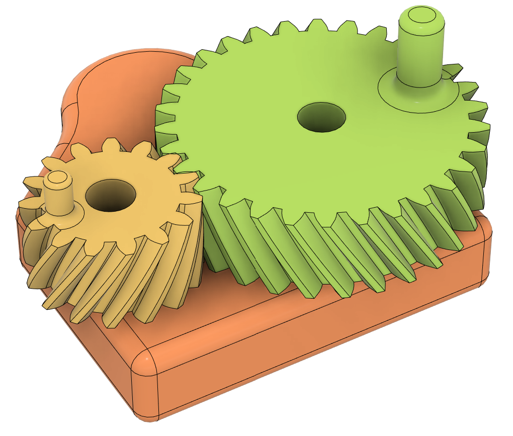
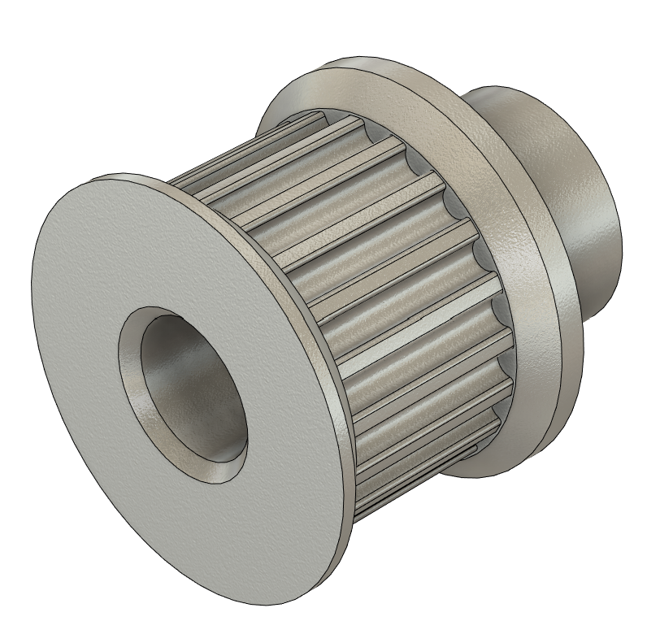

# Fusion 360 
Fusion 360 is a computer-aided design (CAD) software developed by Autodesk. We are going to use it to create the mechanical design of our robot arms and to design the parts we are going to 3D-print.

## Tutorials
Autodesk has a good [collection of online tutorials](https://www.autodesk.com/learn/catalog/product%257Cmicrolearning/Fusion%257Ctutorials) that help us to master most of the important functionalities in Fusion 360. See also the [playlists](https://www.autodesk.com/learn/catalog/product%257Cmicrolearning/Fusion%257Ccuratedlist) focussing on different topics.
Picking modules from this beginners' [self-paced learning collection](https://help.autodesk.com/view/fusion360/ENU/courses/) can also be a way to learn more about specific topics you are interested in.

Here are some tutorials that we think are _particularly useful for this course_:

### Getting started
Very much recommended crash course to get started: [Learn Fusion for CAD in 90 Minutes](https://www.autodesk.com/learn/ondemand/course/learn-fusion-for-cad-in-90-minutes)

### Invite People to a Project
You should collaborate on your CAD designs. Here is how you [invite people to Fusion projects](https://help.autodesk.com/view/fusion360/ENU/?guid=FT-ROLES-FOLDER-LEVEL). 

### Joints in Assemblies
Joints are crucial for defining the relative positions and motions of components in an assembly. [Assembling components with joints](https://www.autodesk.com/learn/ondemand/curated/creating-assemblies/16KmLVIFUJnyTx3tUGAqcB)

### Export for 3D-printing
To 3D-print a part we must export it as a mesh in form of a .stl-file. [Export for 3D-printing](https://www.autodesk.com/certification/learn/module/exporting-for-3d-printing)

### Parametric sketching
[Parametric sketching](https://www.autodesk.com/learn/ondemand/curated/sketch-basics/5kns5wSM7JU0YhJlkDebCO) is a powerful tool to create modifiable and reusable designs. It can save you hours when you need to make changes to a complex design. For an even deeper dive into the parametric modeling world you can check out [Configurations](https://www.autodesk.com/learn/ondemand/curated/configurations).

## Add-ins
Fusion 360 has a lot of useful add-ins that can be installed.  
Here are some for making gears:

- [GF Gear Generator](https://apps.autodesk.com/FUSION/en/Detail/Index?id=1236778940008086660&appLang=en&os=Win64)
- [Helical Gear](https://apps.autodesk.com/FUSION/en/Detail/Index?id=9029586664984391977&os=Win64&appLang=en)

{: width="35%"}

For making pulleys we did not find an add-in, but you could use [this parametric design](https://grabcad.com/library/parametric-gt2-pulley-1).

{: width="35%"}