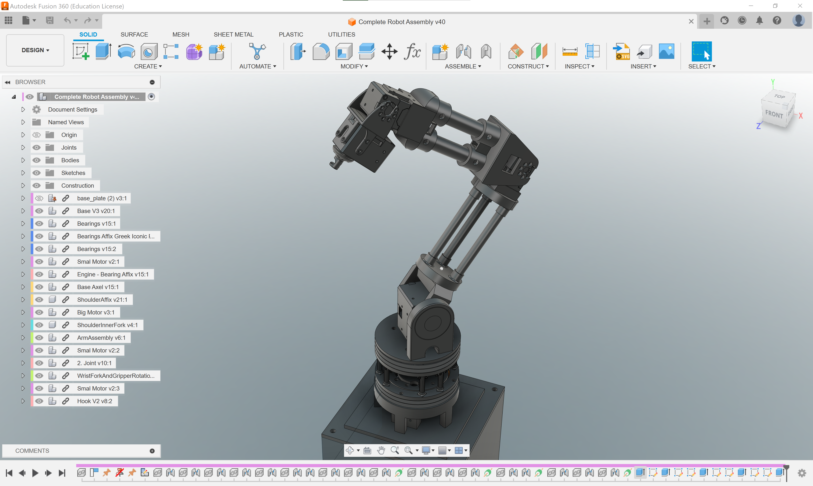

# Fusion 360 
Fusion 360 is a computer-aided design (CAD) software developed by Autodesk. We are going to use it to create the mechanical design of our robot arms and to design the parts we are going to 3D-print.

## Tutorials
Autodesk has a good [collection of online tutorials](https://www.autodesk.com/certification/learn/catalog/product/Fusion%20360) that help us to master most of the important functionalities in Fusion 360.

Here are some tutorials that we think are particularly useful for this course:

### Getting started
Very much recommended crash course to get started: [Learn Fusion 360 in 90 Minutes](https://www.autodesk.com/certification/learn/course/learn-fusion-360-in-90-minutes)

### Joints in Assemblies
Joints are crucial for defining the relative positions and motions of components in an assembly. [Assembling components with joints](https://www.autodesk.com/certification/learn/module/assembling-components-with-joints)

### Export for 3D-printing
To 3D-print a part we must export it as a mesh in form of a .stl-file. [Export for 3D-printing](https://www.autodesk.com/certification/learn/module/exporting-for-3d-printing)

### Parametric sketching
Parametric sketching is a powerful tool to create modifiable and reusable designs. It can save you hours when you need to make changes to a complex design. [Parametric sketching](https://www.autodesk.com/certification/learn/module/fusion360-intro-to-3d-modeling-associate-parametric-modeling-in-fusion-360:-sketching)

## Beginner Course
Following [this course](https://help.autodesk.com/view/fusion360/ENU/courses/) can also be an option to get started.