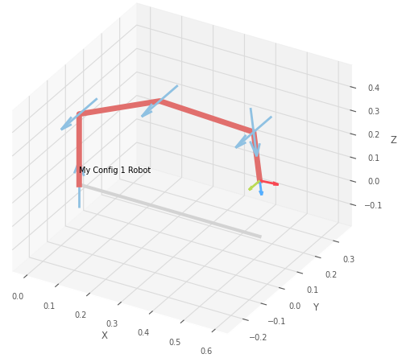

# Kinematic Structure
You can choose one of three pre-defined kinematic structures. The relative orientations of the joints are fixed, but you should modify the link lengths and offsets such that your robot has sufficient workspace.

## Configuration 1
 

*Kinematic Configuration 1: In the second image you can see the parameters you can change in the design process: the link lengths (green) and the link offsets (orange). The joint angles (blue) are used to control the robot during operation.*

To figure out the parameters of your robot, you should use the `config_generator` in the design process. The `config_generator` is part of the [adatools] Python package. Look at the `examples` folder in the package to see how to use it. 
```python
my_conf1_robot = config_generator.get_robot_config_1(link1=0.3, link1_offset=0.0,
                                                     link2=0.3, link2_offset=0.0,
                                                     link3=0.3, link3_offset=0.0,
                                                     link4=0.2, link4_offset=0.0)
```
You can modify the link lengths and offsets, plot the robot, and jog the robot to see if the robot's workspace covers the base plate and corresponds your design ideas.


[adatools]: https://github.com/frdedynamics/adatools

## Configuration 2
To Do

## Configuration 3
To Do

---

## Denavit-Hartenbeg Parameters
{: .d-inline-block }
Optional
{: .label .label-blue } 

Denavit-Hartenberg (DH) parameters are what's behind the formal definition of the kinematic structure. For this project, we exposed only some of the parameters (link lengths and offsets) to keep things simple. Some parameters we kept fixed, such as the relative orientations of the joints.

In general, DH parameters are a set of four parameters for each joint that define the relative orientation and position of the joint axes. The DH parameters are defined as follows: 
<iframe width="560" height="315" src="https://www.youtube.com/embed/rA9tm0gTln8" title="YouTube video player" frameborder="0" allow="accelerometer; autoplay; clipboard-write; encrypted-media; gyroscope; picture-in-picture; web-share" allowfullscreen></iframe>