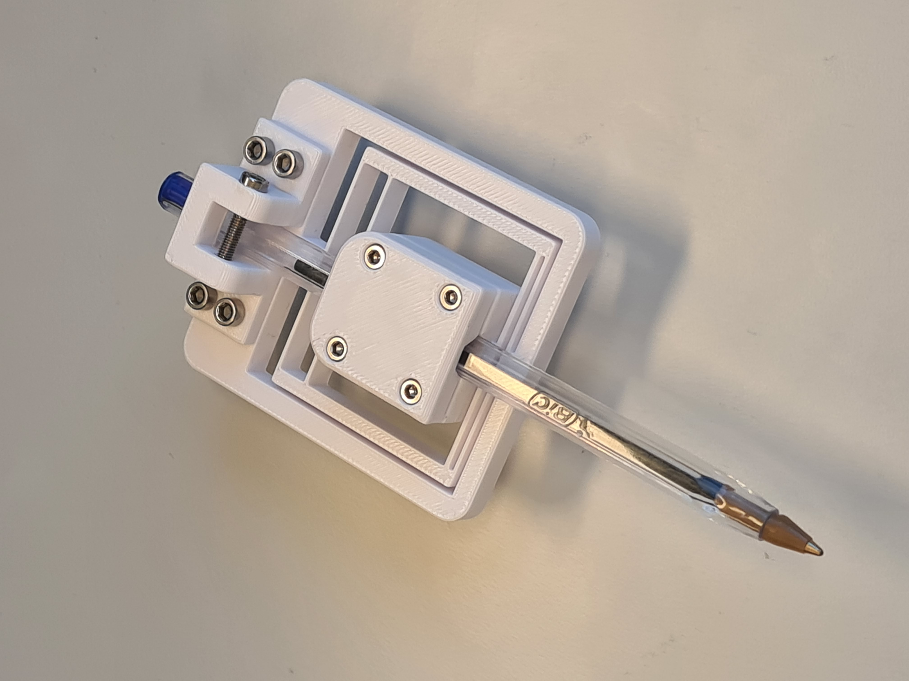

# Mechanical Design

## Designing Links
When designing the links, we should think of the different load types acting on the links. While the crossection of a link does not play any role if the link are under tension or compression, it is extremely important under bending. Bending loads are the most common load in a robot arm, and we should therefore design the links to be as stiff as possible under bending. The kinematic model of an robot arm typically does not account for bending of the links, thus any bending of the links will result in a deviation between the desired and actual end-effector position.
However, we should also consider the weight of the links. The weight of the links will affect the maximum payload of the robot, and the power consumption of the motors. The weight of the links will also affect the inertia of the links, which will affect the dynamic performance of the robot.
Therefore, we should not try to make the links stiff by adding more and more material, making them thick and heavy.
Instead, we should try to make the links stiff by designing them with a crossection that is resistant against bending; adding some material where it is needed, and removing material where it is not needed. We try to balance the stiffness and weight of the links.

The key concept we utilize is the [**second moment of area**](https://en.wikipedia.org/wiki/Second_moment_of_area), also known as the **area moment of inertia**. The second moment of area is a measure of the cross-sectional shape of a beam and provides insight into the beams resistance against bending due to an applied force or moment. To maximize the area moment of inertia as much as possible material should be located as far as possible away from the neutral axis. The second moment of area is a geometrical property of the cross-section, and is therefore independent of the material of the beam. The second moment of area is denoted $$I$$ and has the unit $$m^4.$$ This video summarizes the concept:

<iframe width="560" height="315" src="https://www.youtube.com/embed/Bls5KnQOWkY" title="YouTube video player" frameborder="0" allow="accelerometer; autoplay; clipboard-write; encrypted-media; gyroscope; picture-in-picture; web-share" allowfullscreen></iframe>

### Structural optimization in nature
{: .d-inline-block }
Optional
{: .label .label-blue } 

Efficiency is an evolutionary advantage.
Plants competing for sunlight try to grow tall quickly, but they also need to be stiff to withstand wind and rain. It is and balancing act: using material to grow tall or using material to become stiff.
Thus, a efficient plant that is as stiff as its competitors while using less material will have an advantage over its competitors. Plant stems are often hollow or U-shaped, leaves often bent or U-shaped to concentrate material far from the neutral axis to maximize the second moment of area.

 

Similarly, limbs of animals need to be stiff to be functional, but they should also be light to minimize energy usage.
Evolution has optimized the structure of bones to be as stiff as possible while using as little material as possible. Bones are hollow; material close to the neutral axis without significant contribution to stiffness under bending is removed.

## Designing Joints
Some notes on the design of the joints.

### First Joint
The first joint of your robot, with a vertical rotation axis, has to suspend the weight of the entire robot which causes high torques perpendicular to the joint axis. To absorb these torques we use one or multiple [slewing bearings](https://en.wikipedia.org/wiki/Slewing_bearing) which are characterized by wide rings, and are commonly used to support heavy but slow-turning loads. In this course, we 3D-print our slewing bearings ourself!  
We rely on this [excellent parametric design](https://www.instructables.com/Create-a-Parametric-3d-printable-Slew-Bearing-With/), which lets you modify the dimensions to fit your design.

[Download Slewing Bearing](https://content.instructables.com/F7B/FGGK/J3OPQDLL/F7BFGGKJ3OPQDLL.f3d){: .btn .btn-blue}

<iframe src="https://myhvl14.autodesk360.com/shares/public/SH512d4QTec90decfa6ebce8a17257a2b2f4?mode=embed" width="640" height="480" allowfullscreen="true" webkitallowfullscreen="true" mozallowfullscreen="true"  frameborder="0"></iframe>

## End Effector
### Pen Mount
This is the pen mount we are going to use in [Challenge 1](../project#challenge-1-precision-and-accuracy). Please print it yourself and assemble it. The pen is clamped with M2.5 screws which are directly screwed into the plastic. The weight attachment requires a M3 screw across, which is also directly screwed into the plastic. The weight attachment and the pen holder are held together and mounted to your robot with four M3 screws in a 30x7mm rectangular pattern. The pen holder is designed for [BIC Cristal](https://en.wikipedia.org/wiki/Bic_Cristal) pens.

[Download Pen Mount](../../assets/cad/pen_mount.f3d){: .btn .btn-blue}
[Download BIC Cristal Pen Model](../../assets/cad/BIC_Cristal.STEP){: .btn .btn-blue} 

<object data="../../assets/images/Pen Mount Drawing v4.pdf" type="application/pdf" width="800px" height="550px">
    <embed src="../../assets/images/Pen Mount Drawing v4.pdf">
        
This browser does not support PDFs. Please download the PDF to view it: <a href="../../assets/images/Pen Mount Drawing v4.pdf">Download PDF</a>.

    </embed>
</object>

<iframe src="https://myhvl14.autodesk360.com/shares/public/SH512d4QTec90decfa6e804f3bb73f7c94b1?mode=embed" width="800" height="600" allowfullscreen="true" webkitallowfullscreen="true" mozallowfullscreen="true"  frameborder="0"></iframe>
