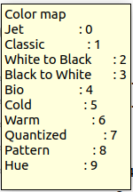

# Intel RealSense D435i RGB-D Camera
The Intel RealSense D435i RGB-D Camera is a depth camera that can be used to create 3D point clouds of the environment. It is used in the course to create a map of the work space and to locate objects therein.

## Connecting the Camera to VM
Make sure you followed the steps for the [RealSense camera under Preparing Your PC](./pc_prep#realsense-camera) on your VM, but there are some tweaks we have to do before we can receive data from the camera.
When the virtual machine is running, click on  ```Player``` in the upper left corner. Go to ```Manage > Virtual Machine Settings```. In the device list, select ```USB Controller``` and click ```Add```. Set the ```USB compatibility``` to ```USB 3.1```, unselect ```Share Bluetooth devices with the virtual machine``` and click ```OK```. 

## Launching the Camera Node
The ROS wrapper of the Realsense SDK comes with a ready-made node that streams the camera data into the ROS network. To launch the camera node, open a terminal and run
```bash
ros2 launch realsense2_camera rs_launch.py
```

Check the topics on the network with 
```bash 
ros2 topic list
```
You should see a list of topics starting with ```/camera```. You should see ```/camera/color/image_raw``` and ```/camera/depth/image_rect_raw```. These are the topics that contain the RGB and depth images respectively. What else you see depends on the parameters you pass to the launch file.

## Parameters of the Camera Node
The camera node can be configured with [parameters](https://github.com/IntelRealSense/realsense-ros/blob/18a1149018132b1e62280d0322ef60a04090c370/realsense2_camera/launch/rs_launch.py#L24) on the ROS parameter server. You can pass parameters to the node by adding them to the launch command. For example, to launch the camera node with a resolution of 640x480 pixels, run
```bash
ros2 launch realsense2_camera rs_launch.py color_width:=640 color_height:=480
```

To see all available parameters on the parameter server you can use ```ros2 param list```. While the camera node is running, you should see a long list of parameters under ```/camera/camera:``` which belong to the RealSense. To see the value of a specific parameter, use
```bash
ros2 param get /camera/camera <parameter_name>
```
To set the value of a parameter, use
```bash
ros2 param set /camera/camera <parameter_name> <value>
```

You can also use the parameter reconfigure interface in ```rqt``` to change parameters. To do so, run ```rqt``` in a terminal. In the ```Plugins``` menu, select ```Configuration > Dynamic Reconfigure```. In the ```Configuration``` window, select ```/camera/camera``` in the sidebar menu. You should now see a list of parameters that you can change. Note that not all parameters can be changed at runtime ([see overview here](https://github.com/IntelRealSense/realsense-ros/tree/ros2-hkr#parameters-that-can-be-modified-during-runtime)). If you change a parameter that cannot be changed at runtime, you have to restart the camera node. **Note**: In our experience the reconfigure interface for the RealSense cameras is a bit buggy and we recommend changing parameters in terminal or programmatically.


## Visualizing the Camera Data in RViz
Image data are not as easily visualized in the terminal as other data types. To visualize the camera data, we use RViz. Make sure the camera node is up and running. To launch RViz, open a new terminal and run
```bash
rviz2
```


### RGB Image
In the ```Displays``` panel, click ```Add```, go to the ```By topic``` tab and select ```/camera/color/image_raw > Image```. Click ```OK``` and a new panel with the RGB cameras video stream should appear.

### Depth Image
In the ```Displays``` panel, click ```Add```, go to the ```By topic``` tab and select ```/camera/depth/image_rect_raw > Image```. Click ```OK``` and a new panel with the depth video stream should appear.
The depth image represents the distance to the camera as intensities and has no colors per se. However, you can change the color map that is applied to the intensities with the ```colorizer``` parameter. Activate the colorizer by running
```bash	
ros2 param set /camera/camera colorizer.enable true
```
Now you choose a color map by 
```bash
ros2 param set /camera/camera colorizer.color_scheme <color_map>
```
where ```<color_map>``` is an integer from 0 to 9.  


If you are not using the colorizer, you may have to deselect ```Normalize Range``` under ```Image``` in the Displays panel and adjust the ```Min Value``` and ```Max value``` to see the depth image.

### Point Cloud
In the ```Displays``` panel, click ```Add```, go to the ```By topic``` tab and select ```/camera/depth/depth/color/points > PointCloud2```. Click ```OK``` and a new panel with the depth video stream should appear. You probably have to changed the ```Fixed Frame``` from ```map``` to ```camera_link```.
**If you do not see the "points" topic, check if you have enabled the point cloud in the camera node.** To do so, check the parameter on the server with
```bash
ros2 param get /camera/camera pointcloud.enable
```
If the output is ```False```, run
```bash
ros2 param set /camera/camera pointcloud.enable true
```
Now you should see the point cloud with the overlayed RGB colors. You can change the size of the points by changing the ```Size (Pixels)``` parameter in the ```PointCloud2``` panel. You can also change the color of the points by changing the ```Color Transformer``` parameter.

## Data Processing in ROS Node
With the camera node streaming data into the ROS network, we can now make a ROS node that subscribes to the camera topics and performs some processing on the data. 

### Making the Node
We are working in the project repository (_2023-ada526-semester-group-project-group-< X>_ ) which should be located in the ```ros2_ws/src``` folder. Open a new terminal, and ```cd``` into ```ros2_ws/src/2023-ada526-semester-group-project-group-<X>/ros```.
Create a new package for your robot with a node (_img_processor_) for the camera processing. Think of a good name for your robot package and replace ```name_of_your_robot_package``` in the following command with your name. You will add more nodes to this package in future. Of course, you could also rename the image processing node if you want to.
```bash
ros2 pkg create --build-type ament_python --node-name img_processor name_of_your_robot_package
```

Now build the package. ```cd``` into ```ros2_ws```. Then run
```bash
colcon build --symlink-install
```
As always after building your ROS workspace, source the environment variables with
```bash
source ~/ros2_ws/install/setup.bash
```

### Editing the node
Open the newly created folder of you package in VSCode and open ```img_processor.py```. The file contains some minimal Python code that we will modify to make the node subscribe to the camera topics and process the data.

Below you see the example code for a minimal subscriber node as described in [our ROS2 resources](https://frdedynamics.github.io/hvl_robotics_website/courses/ada526/pub-sub#create-a-subscriber) or the [official ROS2 docs](https://docs.ros.org/en/foxy/Tutorials/Beginner-Client-Libraries/Writing-A-Simple-Py-Publisher-And-Subscriber.html#id1).
This node initializes a subscriber to the topic ```/topic``` with the message type ```String``` from standard messages in ROS ```std_msgs.msg```. It defines a callback function ```listener_callback``` which is called each time a message arrives. In this case the callback function just prints the received string to the terminal. Of course, this is just a generic example and it does not what we need.

```python
#!/usr/bin/env python3
import rclpy
from rclpy.node import Node

from std_msgs.msg import String

class mySubscriberNode(Node):
    def __init__(self) -> None:
        super().__init__("my_subscriber")
        self.sub = self.create_subscription(
            String,
            'topic',
            self.listener_callback,
            10)
        print("Created")

    def listener_callback(self, msg):
        self.get_logger().info('I heard: "%s"' % msg.data)

def main(args=None):
    rclpy.init(args=args)
    node = mySubscriberNode()
    rclpy.spin(node)

    rclpy.shutdown()

if __name__ == '__main__':
    main()
```
#### Subscribe to RGB Image
Therefore, copy the example code into your ```img_processor.py``` file and:
1. Modify the subscriber such that it subscribes to the color image topic published by the camera node. The message type of the RGB image is ```Image``` from ```sensor_msgs.msg```.
2. Modify the callback function such that it prints the width and height of the received image to the terminal. You can access the width and height of the image with ```msg.width``` and ```msg.height```.
3. Save the changes and test the node. Since we built our workspace with the option ```--symlink-install```, we can run the node directly without building the workspace again. Open a terminal and run
```bash
ros2 run name_of_your_robot_package img_processor
```

#### Add CvBridge
The image data is published as a ROS message of type ```Image```. While this format is useful for sending images around in the ROS network, it is not handy for image processing with Python libraries such as [OpenCV](https://opencv.org/) or the [Machine Vision Toolbox (MVT)](https://petercorke.github.io/machinevision-toolbox-python/index.html). We need to convert the ROS message to an OpenCV image, which also works with MVT. For the conversion, we use the [CvBridge](https://index.ros.org/p/cv_bridge/#foxy) package.
1. Import the CvBridge in the top of the file ```from cv_bridge import CvBridge```
2. Create a CvBridge object in the ```__init__``` function of the node ```self.bridge = CvBridge()```
3. In the callback function, convert the ROS message to an OpenCV image with ```cv_image = self.bridge.imgmsg_to_cv2(msg)```

#### Add Machine Vision Toolbox And Plot Image
Now we can use the [Machine Vision Toolbox (MVT)](https://petercorke.github.io/machinevision-toolbox-python/index.html) to do some plotting and image processing. The MVT is a Python toolbox for image processing and computer vision developed by Peter Corke. It is based on OpenCV and Open3D, provides a lot of useful functions but is not as overwhelming as OpenCV. We are now creating an ```mvt.Image``` object from the ```cv_image```. This gives us access to many useful methods of the ````mvt.Image```` class. For example, we can plot an image with ```my_image.disp()```. All details and parameters to the _disp_ method can be found in the [MVT documentation](https://petercorke.github.io/machinevision-toolbox-python/func_imageio.html#machinevisiontoolbox.base.imageio.idisp).
1. Import the MVT in the top of the file ```import machinevisiontoolbox as mvt```
2. In the callback function, make an ``mvt.Image`` from the OpenCV image: ```img = mvt.Image(cv_image)```  
3. In the callback function, plot the image with ```img.disp(reuse=True, fps=30)```  
   We are passing two parameters to the _disp_ method: ```reuse=True``` which tells the method to reuse the same plot window for each newly arrived frame and ```fps=30``` which sets the frame rate of the plot window to 30 frames per second by making the callback function wait for $$1/30$$ seconds.
4. Save your changes and run the node. You should see a plot window showing the RGB image stream.

#### Add some Image Processing
Smoothing is often a good first step to reduce noise and make the life of many image processing algorithms easier. Smoothing an image with MVT is fairly simple. We can just call the [_smooth_ method](https://petercorke.github.io/machinevision-toolbox-python/stubs/machinevisiontoolbox.Image.smooth.html#machinevisiontoolbox.Image.smooth) of the ``mvt.Image`` object. The _smooth_ method takes standard deviation of the Gaussian kernel as an argument. The larger the kernel size, the more information from neighboring pixels "swaps over" and smoothing effect becomes stronger.

_3x3 Gaussian kernel applied to image. The higher the standard deviation used in the kernel, the more blending with neighboring pixels takes place and the smoother the image gets. (gif from medium.com)_
1. In the callback function, smooth the image with ```img_smoothed = img.smooth(3)```
2. Plot the smoothed image and compare to the original.


**We will continue with more fun stuff here**


<!-- 
<details>
    <summary>Click here</summary>
    hund  
    hund  
    affe  
    affe
</details>
-->