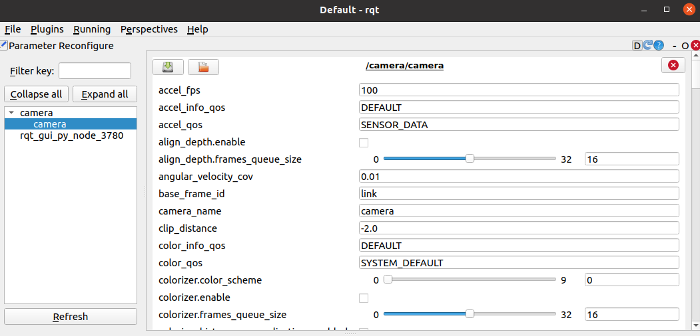

# Intel RealSense D435i RGB-D Camera
The Intel RealSense D435i RGB-D Camera is a depth camera that can be used to create 3D point clouds of the environment. It is used in the course to create a map of the work space and to locate objects therein.

## Connecting the Camera to VM
Make sure you followed the steps for the [RealSense camera under Preparing Your PC](./pc_prep#realsense-camera) on your VM, but there are some tweaks we have to do before we can receive data from the camera.
When the virtual machine is running, click on  ```Player``` in the upper left corner. Go to ```Manage > Virtual Machine Settings```. In the device list, select ```USB Controller``` and click ```Add```. Set the ```USB compatibility``` to ```USB 3.1```, unselect ```Share Bluetooth devices with the virtual machine``` and click ```OK```. 

## Launching the Camera Node
The ROS wrapper of the Realsense SDK comes with a ready-made node that streams the camera data into the ROS network. To launch the camera node, open a terminal and run
```bash
ros2 launch realsense2_camera rs_launch.py
```

Check the topics on the network with 
```bash 
ros2 topic list
```
You should see a list of topics starting with ```/camera```. You should see ```/camera/color/image_raw``` and ```/camera/depth/image_rect_raw```. These are the topics that contain the RGB and depth images respectively. What else you see depends on the parameters you pass to the launch file.

## Parameters of the Camera Node
The camera node can be configured with [parameters](https://github.com/IntelRealSense/realsense-ros/blob/18a1149018132b1e62280d0322ef60a04090c370/realsense2_camera/launch/rs_launch.py#L24) on the ROS parameter server. You can pass parameters to the node by adding them to the launch command. For example, to launch the camera node with a resolution of 640x480 pixels, run
```bash
ros2 launch realsense2_camera rs_launch.py color_width:=640 color_height:=480
```

To see all available parameters on the parameter server you can use ```ros2 param list```. While the camera node is running, you should see a long list of parameters under ```/camera/camera:``` which belong to the RealSense. To see the value of a specific parameter, use
```bash
ros2 param get /camera/camera <parameter_name>
```
To set the value of a parameter, use
```bash
ros2 param set /camera/camera <parameter_name> <value>
```

You can also use the parameter reconfigure interface in ```rqt``` to change parameters. To do so, run ```rqt``` in a terminal. In the ```Plugins``` menu, select ```Configuration > Dynamic Reconfigure```. In the ```Configuration``` window, select ```/camera/camera``` in the sidebar menu. You should now see a list of parameters that you can change. Note that not all parameters can be changed at runtime ([see overview here](https://github.com/IntelRealSense/realsense-ros/tree/ros2-hkr#parameters-that-can-be-modified-during-runtime)). If you change a parameter that cannot be changed at runtime, you have to restart the camera node.


## Visualizing the Camera Data in RViz
Image data are not as easily visualized in the terminal as other data types. To visualize the camera data, we use RViz. To launch RViz, open a terminal and run
```bash
rviz2
```