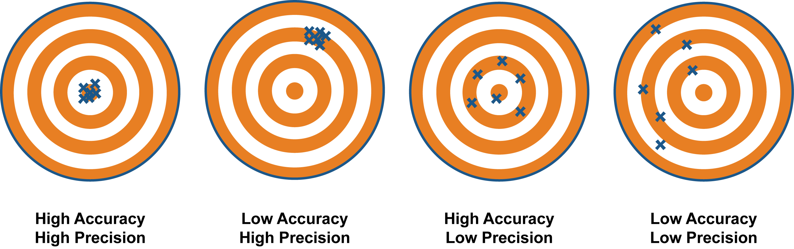
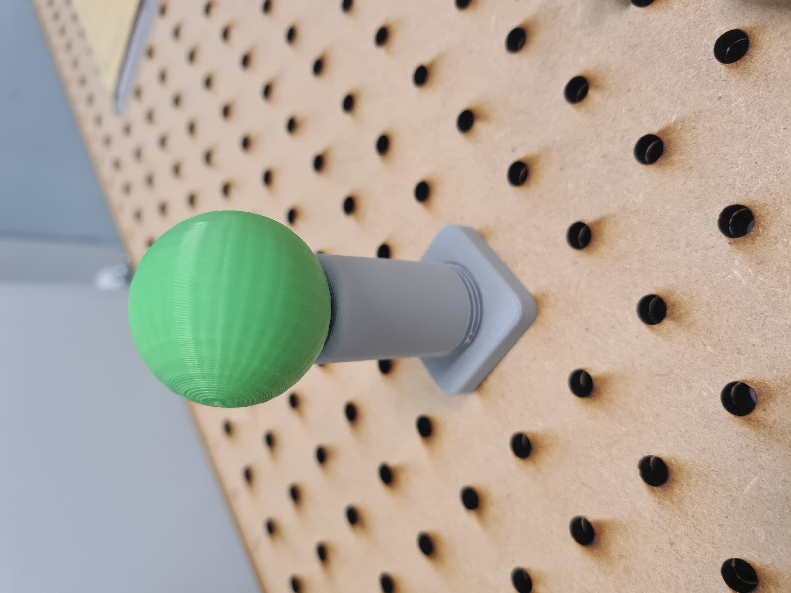
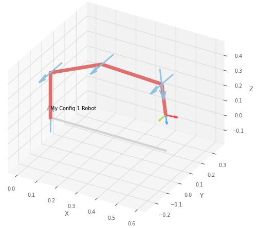
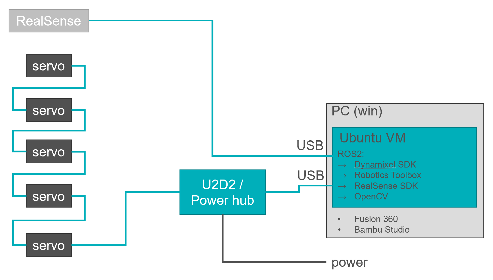

# Project
{: .no_toc }

#### Table of contents
{: .no_toc .text-delta }
1. TOC
{:toc}
---
The project is central to ADA526. In the project you will perhaps learn the most and have the most fun!
In the project you will design and build a robot arm from scratch, and implement basic control algorithms to control the arm based on sensor inputs. Both parts, making the robot and controlling it are important.
Your robots will take part in a competition at the end of the semester, where the tasks require both good design and good control.

## Preliminary Design Review (PDR)
During the PDR, you'll have the opportunity to present your work so far and receive constructive feedback. But remember, the atmosphere should be informal, constructive, and, most importantly, fun! We want to foster an engaging environment where everyone can actively participate and learn from each other.

The PDR should primarily focus on the content covered in modules 1 and 2 of our course, as these provide the foundational knowledge for your robot prototypes. While we don't expect a final robot design at this stage, we expect content along lines of:
- Basic kinematic structure (lengths, offsets etc) 
- Any joint designs 
- Any link designs 
- Selection of materials/structures 
- Design should be supported by basic calculations 
- Design should relate to requirements for competition 

For a more hands-on approach, each group is required to bring at least one physical joint and link pair to demonstrate your hardware progress. We also strongly recommend showcasing any other physical hardware you've constructed and incorporating images and videos of tests you've conducted.
Your presentations will follow a concise 5-minute Powerpoint format, followed by a question and answer session. It's crucial that every member of your group actively participates in both presenting your progress and answering questions.
Furthermore, don't hesitate to ask questions of your own. We encourage inquiries from other student groups. This collaborative approach not only enriches your knowledge but also promotes a supportive atmosphere where innovative ideas can flourish.

## Critical Design Review (CDR)
The CDR has the same format as the [PDR](#preliminary-design-review-pdr), but we expect a more advanced design of your robot. You can present on all of the content listed for the [PDR](#preliminary-design-review-pdr), but in addition we expect:
- A physical prototype of your robot arm that moves
- A RealSense camera mounted to the robot or set-up, streaming data into the ROS network

## Report Requirements
The report should contain extensive and well-explained figures, but also links to supplementary material supporting your project. 

You should link to the [GitHub](https://github.com) repository for the project, where you should share code and other material that helps document your project fully. Please also include the final version of your Fusion 360 design in the repository, as a .f3z file.

Good-quality videos, for example shared on YouTube (private or public), are required to document the design process and experiments with the robot arms, and should be linked to from the report.

Please note that you are yourself responsible for not publishing copyrighted or illegal material on such channels, and you are advised to only include content you yourself have produced, or material that is under a suitable open source license, and where you have given suitable attribution. 

You are free to make your repository public, if you want. However, suggest to include an open source license if you make it public. For more information on for example the Creative Commons open source licences: [https://creativecommons.org](https://creativecommons.org)

**The report assignment should be submitted as a group, and as a single pdf document.** Please note that the report will be submitted on WiseFlow, and that there will be a plagiarism check. **In addition, each group should submit a .zip file containing the last version of their GitHub repository on Wiseflow.**

### Structure and Content
The report should be 3000 words plus/minus 10%. The report should contain the following sections and suggested content (as a minimum):

1.	Introduction
    - Brief introduction to the project and requirements
    - An overview of your approach to the robot design and control strategy
2.	Design Process
    - What design iterations have you gone through?
    - Who worked on what, and when?
    - What problems did you encounter, and how did you solve them?
3.	Implementation
    - Describe the final design of your robot arm
    - Include figures with images/drawings etc
    - Include your calculations on structural analysis, kinematics, mechanics etc
    - Include diagrams of your approach to software, vision and control
    - Be brief, include support material in appendices, if need be
4.	Experiments 
    - What testing have you performed of the robot (or subsystems)
    - How well have you been able to perform the different challenges during the development process?
    - Use videos, images and data (tables, plots etc) to show the results of the experiments in the report
5.	Discussion and Conclusion
    - Briefly discuss the design of the robot, the results obtained, and the design process followed
    - Critically evaluate any flaws in the design, and how could be improved upon

### References
- Here you should put a numbered list of references to all sources you have used in the report, using IEEE referencing style
- These references should be cited from the text, using the IEEE citation format with citation number in square brackets, e.g. [3] for the third reference in the list
- For guidance on the IEEE referencing style, see [here](https://www.bath.ac.uk/publications/library-guides-to-citing-referencing/attachments/ieee-style-guide.pdf) 

### Appendices
- Include here the 3 presentations made for the PDR, CDR and final presentations. 
- Also include here a log of what each group member worked on during the project, in terms of theory, code, design, presentations, and report writing. All members of the group have to sign this log.

### Template
The report template is inspired by the IEEE conference paper format with two columns. Larger images and tables can span both columns. 

[Download Report Template](https://hvl365.sharepoint.com/:w:/s/RobotikkUndervisningHVL/ETguOKhRBKFKrW_sCqBFonMBfPKLOrCUDw0KG6mT6W6HBw?e=10Catp){: .btn .btn-blue}

## Competition
At the end of semester, we want to organize a showcase and competition. Each group gets the chance to present their robot and then competes in three challenges.
The challenges focus on different qualities of your robot. You will collect points in each challenge, and the total sum of points collected will determine the winner. There is no minimum number of points you need to reach in each challenges - it is up to you if you want to be strategic and specialize your robot design towards a subset of the challenges, or if you want to build an all-round robot that can perform well in all challenges. 

### Challenge 1: Precision and Accuracy
This challenge is about testing the precision and accuracy of your robot. We will provide fixtures for replaceable paper targets that fit into the mounting holes on the base plate. We also provide a [pen holder design](./How-to%20Guides/mechanical_design#pen-mount) to be mounted to the end effector of your robot. The pen holder has an attachment for small payloads. The goal is to make five dots with the pen at the center of the target, while small payloads are added to the end effector in-between the trials. The distribution of the dots around the center of the target (distance of mean to center, and standard deviation) will be used to calculate the score. We may define a (rather generous) time limit per group. This challenge is not about speed, but we want to prevent tinkering during the trials.

[to Pen Holder Design](./How-to%20Guides/mechanical_design#pen-mount){: .btn .btn-blue}
 - In advance: Each group must define a home pose for their robot which can't be changed after the target coordinates are announced.
 - The target coordinates and the payloads are announced. The order of the payloads for each trial is randomized.
 - The groups perform the challenge one after another. 5 trials per group.
 - Each trial starts from and ends at the defined home pose.
 - The robot must neither be touched nor manually controlled during the trials.
 - The score is calculated based on distance of mean to center and standard deviation. If the marking is not just a dot, the point of the parking with the greatest distance to the center is used for the calculation.

### Challenge 2: Vision, Control and Speed
In this challenge we test your robot's capabilities of vision-based control and dynamic movements. We will provide two targets that can easily be tracked by a camera (a blue ball and a green ball, 40mm diameter) which will be placed on two fixtures that fit into the mounting holes in the base plate, and the end effector (pen) from the first challenge is used to knock the balls off the fixtures. The goal is to identify the location of the balls with the camera, to then knock them off the fixtures with the pen as quickly as possible. The time between hitting the first ball and the second ball is measured and used to calculate a score. Three different locations of the targets are used, and the order of the targets is randomized. The coordinates will not be announced in advance -- you have to use the camera to identify their location.
 - In advance: Each group must define a home pose for their robot which can't be changed after the first targets are placed.
 - The groups perform the challenge one after another. One trial for each of the three target locations per group.
 - The targets are placed on the base plate. The order of the targets is randomized.
 - Each trial starts from the defined home pose.
 - The tip on the end effector must knock off the first target. Time is taken. The tip must then knock off the second target. Time is taken. The time between the two targets is used to calculate the score.
 - The robot must neither be touched nor manually controlled during the trials. 

### Challenge 3: Strength
This challenges tests the physical strength of your robot. We will provide an end effector to which increasing payloads can be attached. The goal is to lift the payload at a distance of 45cm from the robot's base above a height of 15cm and hold it there for 5 seconds. The groups can decide how much weight they want to try to lift. Each group can freeze the payload they lifted successfully three times. At the end the highest frozen payload counts, and the group with the highest frozen payloads wins.
A lift counts as failed if the payload is not lifted and held above the required height for the required time, if a motor overloads, if any part of the robot except its base touches the base plate or if the robot is touched by hand. This challenge has no requirements regarding the control of the robot. You can use any control strategy you want, including manual control/teleoperation. 
 - Each group announces a starting payload $$\geq 0$$g in advance.
 - One group is picked at random to start.
 - The group tries to lift their announced payload. If they succeed, they can decide to freeze the payload, or they can risk it and announce a higher payload without freezing, saving a freeze for later. Repeat until the group has used up all three freezes or fails to lift the announced payload.
 - The next group is picked at random and the process repeats.
 - The group with the highest frozen payload wins.

## Base Plate
Each group gets a standardized base plate for mounting the robot on. The mounting holes for the robot are in a 150mm square pattern, M6 screws will be inserted from the bottom of the plate. The plate will also be used as the arena for the competition at the end of the semester. Therefore, it is important that the robot can reach all the corners of the plate.  
[Download Base Plate](https://a360.co/45MN0mZ){: .btn .btn-blue}
<iframe src="https://myhvl14.autodesk360.com/shares/public/SH512d4QTec90decfa6e3b9f03e7d311b26e?mode=embed" width="640" height="480" allowfullscreen="true" webkitallowfullscreen="true" mozallowfullscreen="true"  frameborder="0"></iframe>

## Kinematic Structure
The kinematic structure of the robot is pre-defined. This means, the number of joints and the relative orientations of the joint axes are fixed, but you have to modify the link lengths and offsets such that your robot's workspace more or less covers the base plate.
You find more detailed information about kinematic structures in the [How-to Guides: Kinematic Structure](../docs/how-to guides/kinematic_structure.html).

## Actuators
We use Dynamixel X-series servo motors in the project.

 Each group gets the following kit:

| Qty | Description                               |    
| :-- | :---------------------------------------- | 
| 4   | [Dynamixel XM430-W350-T]                  |  
| 1   | [Dynamixel XM540-W150-T]                  |  
| 1   | [U2D2 TTL to USB communication converter] |  
| 1   | [U2D2 Power Hub]                          |
| 1   | [12V 5A power supply]                     |

[Dynamixel XM430-W350-T]: https://emanual.robotis.com/docs/en/dxl/x/xm430-w350/
[Dynamixel XM540-W150-T]: https://emanual.robotis.com/docs/en/dxl/x/xm540-w150/
[U2D2 TTL to USB communication converter]: https://emanual.robotis.com/docs/en/parts/interface/u2d2/
[U2D2 Power Hub]: https://emanual.robotis.com/docs/en/parts/interface/u2d2_power_hub/
[12V 5A power supply]: https://www.robotshop.com/en/12v-5a-power-supply.html

## Sensors
The Dynamixel motors have built-in encoders that we use to measure the joint angles for control. 
In addition, we use [Intel RealSense D435i] depth cameras in the project. These cameras can record depth and RGB images, and have an integrated IMU. The camera is connected to the PC via USB 3.0.
For communication with the camera, we use the ROS2 wrapper of the [Intel RealSense SDK 2.0].

Example of a point cloud with overlayed RGB colors recorded with a RealSense camera in ROS:

[Intel RealSense D435i]: https://www.intelrealsense.com/depth-camera-d435i/
[Intel RealSense SDK 2.0]: https://dev.intelrealsense.com/docs/ros-wrapper

## Software
We use the [Robotics Toolbox for Python] by Peter Corke. The toolbox is a collection of Python modules that implement functions for robot kinematics, dynamics, and trajectory generation.
We will use the toolbox in the design phase to asses the kinematic structure (link lengths etc.) of the robot, and when controlling the robot to implement the inverse kinematics and trajectory generation.
For the underlying math, to represent, plot and manipulate position and orientation of objects, the toolbox makes use of the [Spatial Math] package.
To simplify some of the rich functionality of the robotics toolbox, we provide [adatools], a collection of convenience functions and examples.
For control, we will integrate the toolbox with [ROS2 Foxy Fitzroy] by importing it in our ROS nodes. 
Camera data will be streamed into the ROS network and used to generate commands for the motors.

[Robotics Toolbox for Python]:https://petercorke.github.io/robotics-toolbox-python/index.html
[Spatial Math]:https://bdaiinstitute.github.io/spatialmath-python/index.html
[ROS2 Foxy Fitzroy]:https://docs.ros.org/en/foxy/Tutorials.html
[adatools]:https://github.com/frdedynamics/adatools
<!--Mention robot_from_dh ? -->

## System Architecture
The central hub for data processing is your own PC running a virtual machine with Ubuntu 20.04. Motors and cameras are connected to your PC, or rather the VM, by USB. Sensor inputs and motor commands as well as computer vision data are exchanged via the ROS2 middleware. 
Just Fusion 360 for CAD and Bambu Studio for preparing 3D-prints are running on your host system.

