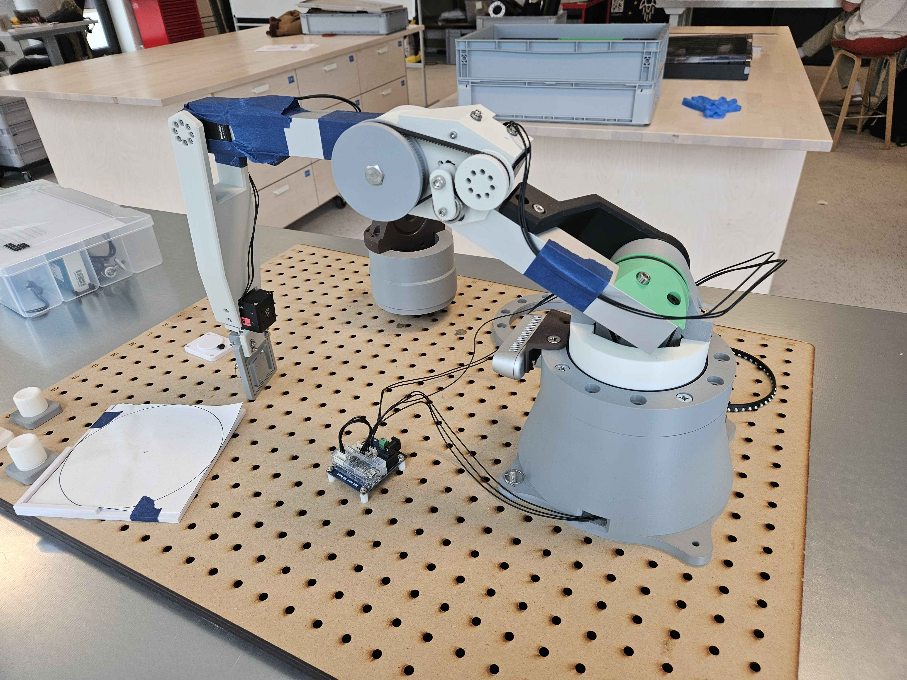
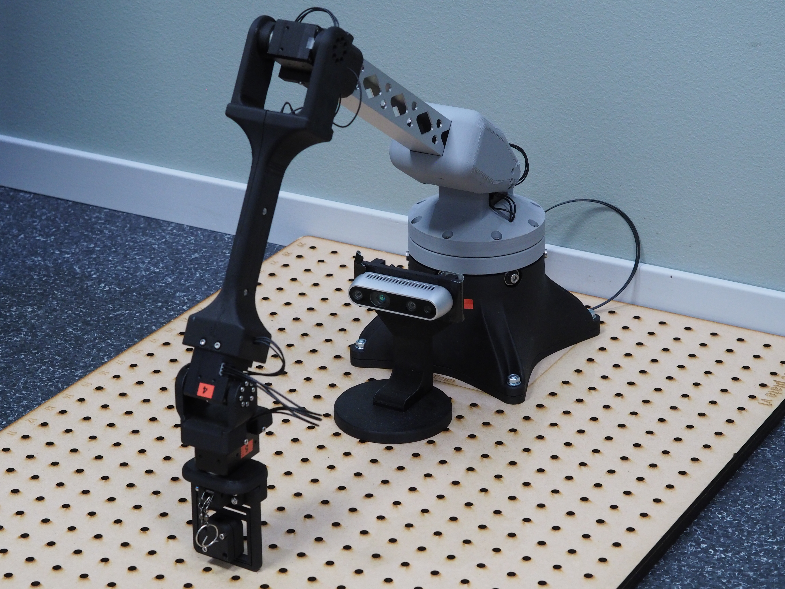

# Robot Gallery
{: .no_toc }

Here are some pictures of robots built by students in recent years. For inspiration and to learn from.

  <a class="gallery-year-card" href="robot_gallery_2025.html">
    
    2025 Robots
  </a>
  <a class="gallery-year-card" href="robot_gallery_2023.html">
    
    2023 Robots
  </a>

